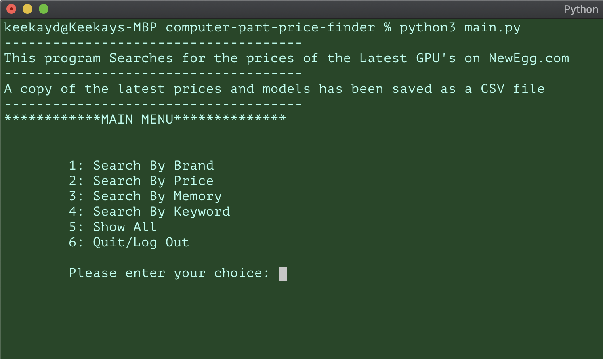
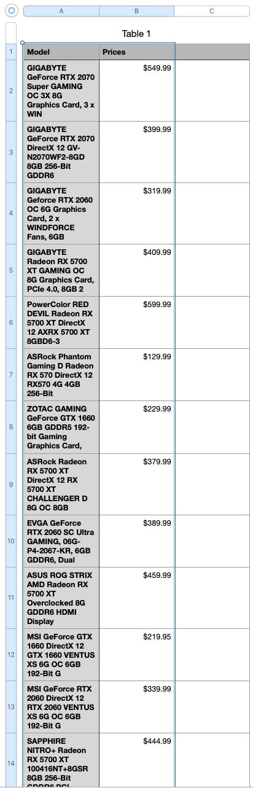

# Command Line PC Part Finder 
Web Scraper

This searches Newegg.com for the latest GPU prices and organizes them in an Excel Spreadsheet and Json File.

##  Demo

## Powered by

- [Python3](http://python.org)
- [Beautifulsoup4](https://pypi.org/project/beautifulsoup4/)
