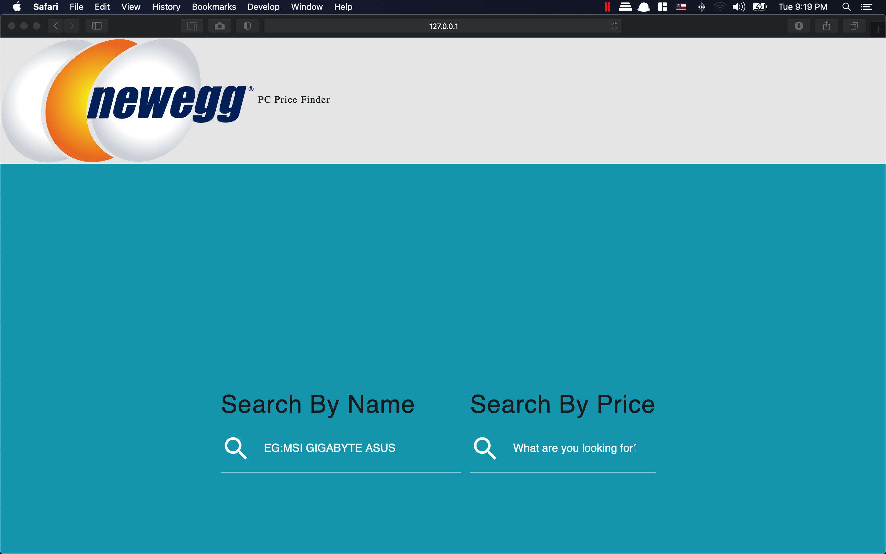

# Command Line PC Part Finder 
Web Scraper

This searches Newegg.com for the latest GPU prices and organizes them in an Excel Spreadsheet and Json File.

JavaScript for Frontend Search

Flask/Python3 for backend

# Coming Soon 
MYSQL Database to keep track of prices
Notifications for lowest prices

##  Demo

## Powered by

- [Python3](http://python.org)
- [Beautifulsoup4](https://pypi.org/project/beautifulsoup4/)

""" @app.route("/results", methods=['POST'])
def searchbrand():
    search = request.form('text')
    Table = []
    res2 = dict(filter(lambda item: search in item[0], dictionary.items()))
    for key, value in res2.items():
        temp = []
        # Note that this will change depending on the structure of your dictionary
        temp.extend([key, value])
        Table.append(temp)
 """